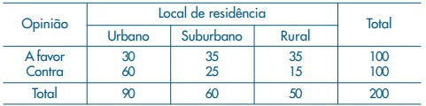
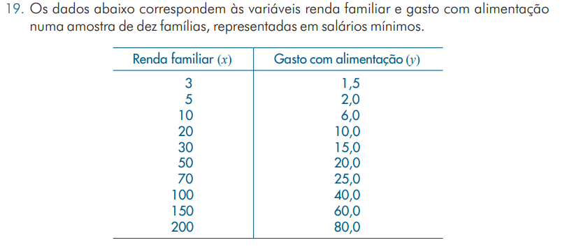
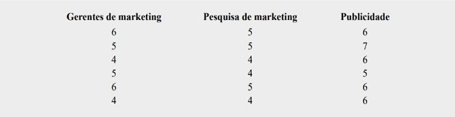

O propósito deste trabalho é resolver alguns exercícios de Testes de Hipóteses propostos pela disciplina de Estatística II do curso de graduação em Estatística da Universidade Estatual de Maringá.

Instruções para o uso do R Notebook:

1. Tente executar este pedaço clicando no botão *Run* dentro do pedaço ou colocando o cursor dentro dele e pressionando *Ctrl+Shift+Enter*.

2. Adicione um novo pedaço clicando no botão *Insert Chunk* na barra de ferramentas ou pressionando *Ctrl+Alt+I*.

3. Para instalar um pacote utilize, por exemplo: install.packages("vcd")


#### Bibliotecas usadas
```{r message=FALSE, warning=FALSE}
library(summarytools)
library(vcd)
library(tidyr)
```
   
_________________
### Exercício 1
#### TESTE DE HIPOTESES PARA DIFERENÇA DE DUAS MÉDIAS PAREADAS

**EX_21:** Uma empresa de pesquisa de mercado usou uma amostra de indivíduos para avaliar o potencial de compra de determinado produto antes e depois de as pessoas virem um novo comercial de televisão a respeito do produto. As avaliações do potencial de compra basearam-se em uma escala de 0 a 10, e os valores mais altos indicavam maior potencial de compra. A hipótese nula declarava que a avaliação média depois seria igual a avaliação média antes. A rejeição dessa hipótese demonstraria que o comercial melhorou a avaliação do potencial médio de compra. Use  α = 0,05 e os dados apresentados abaixo para testar a hipótese e comentar o valor do comercial.

*Referencia: Anderson, et. al, Estatística Basica, 2010. Exercício 21 - Página. 411*


#### Notas antes e depois do comercial
```{r}
antes   <- c(5, 4, 7, 3, 5, 8, 5, 6)
depois  <- c(6, 6, 7, 4, 3, 9, 7, 6)
```

#### Resolução 1. utilizando "t.test"
```{r}
t.test(antes,depois,paired = TRUE)
```
Como o p_valor > 0,05, não se rejeita a hipótese H0, ou seja, ao nível de 5% de significância, as médias de avaliação de um determinando produto antes e depois da circulação do comercial são iguais.
   
_______________
#### Resolução 2. Passo a Passo:

#### Cálculos Iniciais
```{r}

diferenca <- depois - antes
diferenca
n <- length(diferenca)
significancia <- 0.05

# grau de liberdade
gl <- n - 1
gl

# Diferença
media_diferenca <- mean(diferenca)
var_dif <- var(diferenca)
desvio_dif <- sd(diferenca)

# Antes
media_antes <- mean(antes)
var_antes <- var(antes)
desvio_antes <- sd(antes)

# Depois
media_depois <- mean(depois)
var_depois <- var(depois)
desvio_depois <- sd(depois)

# Tabela RESUMO
tabela <- data.frame(Referencia = c("Antes","Depois", "diferenca"),
                    Media = c(media_antes,media_depois,media_diferenca),
                    Variancia = c(var_antes,var_depois,var_dif),
                    Desvio = c(desvio_antes,desvio_depois,desvio_dif)
                    )
tabela
```

#### Passo 1 - Hipóteses

    * Ho: media_antes = media_depois
    * Ha: media_antes < media_depois

    ou

    * Ho: media_diferenca = 0
    * Ha: media_diferenca > 0

#### Resultados possíveis

    * Ho: As avaliações médias antes e depois do comercial são iguais;
    * Ha: As avaliações antes e depois do comercial são diferentes, sendo maior a media das avaliações após a circulação do comercial.

#### Passo 2 - Estatística Teste

```{r}

t_teste <- media_diferenca / (desvio_dif/sqrt(n))
t_teste
```

#### Passo 3 - Definir a Região Crítica e p_valor

* Região crítica
```{r}
t_critico <- qt(significancia,df = gl,lower.tail = FALSE)
t_critico


```

* p_valor
```{r}
p_teste <- pt(q = t_teste,df = gl,lower.tail = FALSE)

p_valor <- 1*p_teste
p_valor

```

#### Passo 4 - Comparação

i) Como o p_valor > alfa (0,05), não rejeitamos a hipótese Ho;

ii) Como t_teste = 1,357 não pertence a região crítica, não rejeitamos Ho.

#### Passo 5 - Conclusão

As médias de avaliação de um determinando produto antes e depois da circulação do comercial são iguais, ao nível de 5% de significancia.

_________________________
_________________________

### Exercício 2
#### TESTE DE HIPOTESES PARA DIFERENÇA DE DUAS MÉDIAS DE POPULAÇÕES NORMAIS COM VARIÂNCIAS DESCONHECIDAS


*Referência: Bussab & Morettin - Página 372 - Exercício 9*

```{r}
liberais  <- c(6.6, 10.3, 10.8, 12.9, 9.2, 12.3, 7.0)
adm  <- c(8.1, 9.8, 8.7, 10.0, 10.2, 8.2, 8.7, 10.1)

significancia <- 0.05
```


```{r}
n_liberais <- length(liberais)

n_adm <- length(adm)

mediaLiberais <- mean(liberais)

mediaAdm <- mean(adm)

desvio_liberais <- sd(liberais)

desvio_adm <- sd(adm)

var_liberais <- var(liberais)

var_adm <- var(adm)


tabela <- data.frame(informacoes=c("amostra","media","desvio_p","variancia"), liberais = c(n_liberais,mediaLiberais,desvio_liberais,var_liberais), adm = c(n_adm, mediaAdm, desvio_adm,var_adm))
tabela

```

#### Teste de Variância

    * Ho: variancia a = variancia d
    * Ha: variancia a <> variancia b

#### Resultados possíveis

    * Ho: As variancia são desconhecidas e iguais, portanto homogêneas;
    * Ha: As variancias são desconhecidas e diferentes, portanto não homogêneas.

#### Passo 2 - Estatística Teste

```{r}

f_cal <- desvio_liberais/desvio_adm
f_cal

```
#### Passo 3 - Definir a Região Crítica

* Região crítica

```{r}
f_critico <- qf(0.975,n_liberais-1,n_adm-1)
f_critico

f0 <- 1/f_critico
f0

```
#### Comparação

Como f_cal = 2,74 não pertence a região crítica, não rejeitamos H0.

#### Decisão

Como não rejeitamos a hipótese H0 ao nível de 5% de significância, concluímos que as variâncias são desconhecidas e iguais.

Assim, seguimos com o teste de hipóteses para a diferença de médias.

___________
#### Teste de Hipóteses

#### Passo 1 - Hipóteses

    * Ho: media_adm = media_liberais
    * Ha: media_adm <> media_liberais
    
#### Resultados possíveis

    * Ho: As avaliações médias antes e depois do comercial são iguais;
    * Ha: As avaliações antes e depois do comercial são diferentes.
    
#### Passo 2 - Estatística Teste

```{r}
sp <- sqrt(((n_adm-1)*var_adm) + ((n_liberais-1)*var_liberais))/(n_adm+n_liberais-2)

t_teste <- (mediaAdm - mediaLiberais)/sp*((1/n_adm)+(1/n_liberais))
t_teste
```

#### Passo 3 - Definir a Região Crítica e p_valor

* Região crítica
```{r}
razao_sn_adm <- var_adm/n_adm
razao_sn_liberais <- var_liberais/n_liberais

gl <- ((razao_sn_adm + razao_sn_liberais)^2) /(((razao_sn_adm^2)/(n_adm-1)) + ((razao_sn_liberais^2)/(n_liberais-1)))
gl

t_critico <- qt(significancia/2,df = gl,lower.tail = TRUE)
t_critico

```

* p_valor
```{r}
p_teste <- pt(q = t_teste,df = gl,lower.tail = TRUE)

p_valor <- 1*p_teste
p_valor

```

#### Passo 4 - Comparação

i) Como o p_valor > alfa (0,05), não rejeitamos a hipótese Ho;

ii) Como t_teste = -1,879 não pertence a região crítica, não rejeitamos Ho.

#### Passo 5 - Conclusão

As médias de salários iniciais de recém-formados liberais e administradores são iguais, ao nível de 5% de significância.

_________________________
_________________________

### Exercício 3

*EX_19:* Uma amostra de 200 habitantes de uma cidade foi escolhida para declarar sua opinião sobre um certo projeto governamental. O resultado foi o seguinte:.



Referencia: Bussab & Morettin 2013. Exercício 19 - Página. 94

```{r}
opiniao  <- c("aFavor", "contra")
urbano  <- c(30, 60)
suburbano  <- c(35, 25)
rural  <- c(35, 15)
significancia <- 0.05
```

```{r}
df = data.frame(opiniao, urbano, suburbano,rural)

df[3,-1] <- df[1,-1] + df[2,-1] 

df[3,1] <- "Total_y"

df[,5] <- df[,2]+df[,3] + df[,4]
df

```
#### 1 Hipóteses
    * Ho: As opiniões são independentes da região;
    * Ha: As opiniões são dependentes da região.

#### 2 Estatística Teste
  * Frequência esperada
```{r}
df
m_eij <- matrix(1:6, nrow = 2, ncol = 3)
m_eij
for (linha in 1:2) {
  for (coluna in 1:3) {
    m_eij[linha,coluna] <- (df[linha,5] * df[3,coluna + 1])/df[3,5]
    
  }
  
}
m_eij

```
  * Qui_quadrado calculado
```{r}
soma <- 0
for (linha in 1:2) {
  for (coluna in 1:3) {
    x_cal <- ((df[linha,coluna + 1] - m_eij[linha,coluna])^2)/m_eij[linha,coluna]
    soma <- soma + x_cal
  }
  
}
x_cal <- soma  
```

#### Grau de liberdade e significancia
```{r}
gl <- (2-1) * (3 - 1)

#chisq.test(df[,-1])
```

* Encontrar p_valor pela tabela

Encontramos o valor de qui_quadrado calculado (19,667), referente ao grau liberdade gl=2. O p_valor encontrado foi:
  
  p_valor < 0,001.
  
#### 3 Comparação
  
  Como p_valor < significania (alfa = 0,05), Rejeita-se H0;
  
#### Conclusão

  Ao nível de 5% de significancia, 

_______________________
_______________________

### Exercício 4

**4) Análise de regressão: livro Bussab & Morettin (2013), página 94,exercício_19;**



```{r}
df <- data.frame(Renda = c(3,5,10,20,30,50,70,100,150,200),
                 Gasto = c(1.5,2,6,10,15,20,25,40,60,80)
                 )
df
```
```{r}
modelo <- lm(Gasto ~ Renda, df)
modelo

par(mfrow = c(2,2))
plot(modelo)
```
#### Coeficientes

```{r}
modelo$coefficients
```
A equação de regressão é:

**Gasto = 0,9536 + 0,3918 * Renda**


___________________
___________________

### Exercício 5

**17. Os dados a seguir são de um experimento desenvolvido para investigar a percepção de valores éticos corporativos entre pessoas especializadas em marketing (notas mais altas indicam valores éticos mais elevados).** 

*livro Anderson, et al. (2021), página 501, exercício 17.*



```{r}

df <- data.frame(gerente=c(6,5,4,5,6,4), pesquisa = c(5,5,4,4,5,4), publicidade = c(6,7,6,5,6,6))
df

df_long <- pivot_longer(df, 
                        cols = everything(),  # seleciona todas as colunas
                        names_to = "Cargo",  # nome da nova coluna para as variáveis
                        values_to = "valor")  

df_long
```
```{r}
boxplot(df_long$valor ~df_long$Cargo)
```


#### Estatísticas
```{r}

media <- sapply(df, mean)
media

desvio_amostra <- sapply(df,sd)
desvio_amostra

variancia_amostra <- sapply(df, var)
variancia_amostra
```

#### Teste homogeneidade de Variâncias
#### Anova
```{r}
fit <- aov(valor ~Cargo,df_long)
anova(fit)
```
Como p_valor = 0,007 é menor que alfa (0,05), há homocedasticidade, ou seja, as variâncias desconhecidas e iguais.

#### Seguindo com o teste de hipótese para o exercício.


#### Passo 1 - Hipóteses

    * Ho: media_adm = media_liberais
    * Ha: media_adm <> media_liberais
    
#### Resultados possíveis

    * Ho: As avaliações médias antes e depois do comercial são iguais;
    * Ha: As avaliações antes e depois do comercial são diferentes.
    
#### Passo 2 - Estatística Teste

```{r}
sp <- sqrt(((n_adm-1)*var_adm) + ((n_liberais-1)*var_liberais))/(n_adm+n_liberais-2)

t_teste <- (mediaAdm - mediaLiberais)/sp*((1/n_adm)+(1/n_liberais))
t_teste
```

#### Passo 3 - Definir a Região Crítica e p_valor

* Região crítica
```{r}
razao_sn_adm <- var_adm/n_adm
razao_sn_liberais <- var_liberais/n_liberais

gl <- ((razao_sn_adm + razao_sn_liberais)^2) /(((razao_sn_adm^2)/(n_adm-1)) + ((razao_sn_liberais^2)/(n_liberais-1)))
gl

t_critico <- qt(significancia/2,df = gl,lower.tail = TRUE)
t_critico

```


